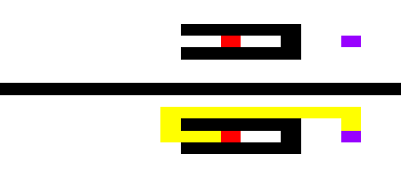
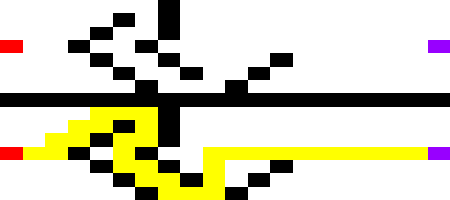
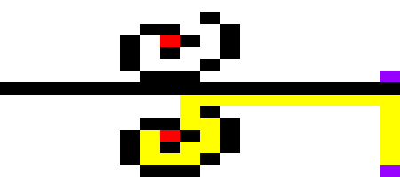
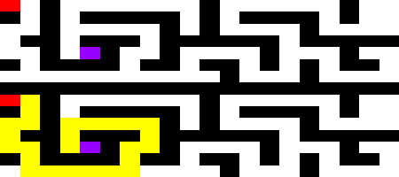

# Using the A* Algorithm

## Overview
In this assignment, you will become familiar with the A* algorithm by applying it 
to a classical use case for A*, namely that of finding the shortest path in a 
two-dimensional grid-like world.

In order to solve this assigment I had to implement a version of A* star that went 
through the two-dimensional arrays that we where given in .txt format. I therefore 
first had to implement a method that read the file and convertet it to a more
fitting datastructure.

**Datastructures**   
I went for converting the boards from the text files into a Board object which hold the
information about each cell in the board, where to start and where it ends, which cells
are opened and which that are closed. Each cell in the board was also represented as its
own object in the Board class. The Cell class hold information about the position of
the cell in the two-dimensional array, if it is possible to "walk" on and what it costs
to do it if possible. It also hold the information about the neighbours (nort, east, 
south and west) and the current best parent. Along the way in the A* algorithm we also
need the cost for the path so far, g, and the estimated value for the cost of the 
remaining path, h (Manhatten distance).

So the first step of this task was to build the board with the use of the datastructures
that I had made. That is what the **make_board** method is for. It takes the path to
the .txt file and iterates through and return a Board consisting of all the Cells etc

**A\* Implementation**  
So now that we had built the board ready for use, I could now implement the A* star 
loop. Here i used the pseudocode from "Supplement - Essentials of the AStar Algorithm.pdf"
which I have added to this folder. I have written some comments in the code about
what the task of each method that is being used in the loops are. This is methods like
**set_all_successors**,**attach_and_evaluate** and **propagate_path_improvements**. 

**Path drawing**  
For drawing the board I used Python Imaging Library (PIL). After the A* loop was done,
I could now just go backwards from the end cell and ask about their best parent until
I got back to the start cell. In the old string based two-dimensional array I now changed
the sign of the best parents to "O" so when drawing the board i could set the 
shortest path in different color (yellow). The other colors are set in the **draw_path** 
method where I have a map maps from a sign in the 2d-array to RGB tupples. 
The easiest way to draw this was just to make a new Image with a set width and height 
with the use of PIL, and then just map all the values in the string based 2d-array 
to their RGB tupples and just put the data to the Image. 

The method that starts it all is **find_shortest** path which set some initiale values on
the board cells and makes sure that we draw the image after the A* loop is done.

## Part 1: Grids with Obstacles
In this part we got board where we had to find the shortest path from A to B with
some obstacles that i call walls in my code. A wall can not be walked on, and therefore
we need to walk around them. In this task each cell has the cost 1, so we don´t need to
think about the price of doing a move yet. 

In my draw method, I first draw the old board, and then concatenate it with the new board 
where the shortest path is set. 

Here are my results:  
  

  

  

  

